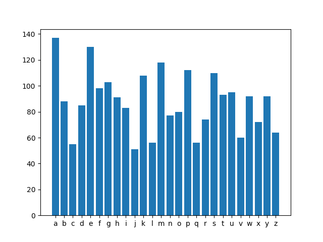

# Capit
A simple neural network to solve captchas. 
It was developed for a hackerton challenge.

## Background

One of the challenges was to connect to a website and
solve one hundred different captchas within a given time.
Such a captcha is shown below.

The first attempt was to use the Tesseract OCR from google. 
Unfortunately, was this not efficient enough since it was too slow and had a low success rate. 
It should be noted that this is not the intended use of tesseract.
Therefore, a separate network was developed to classify each letter.

## Creating training data
Using the website, which confirmed correct captcha, and Tesseract, the correct
captcha were stored as training data. Therefore, the data were generated automatically with 
Tesseract.

The resulting training data are not perfectly balanced for 
the training of the network. However, they were sufficiently good for solving the challenge.

 
 
 
## The Network
Finally, the network was tested. 
For this purpose, 50 data sets were randomly selected from the training data. 
The network was trained with the remaining ones and then the number of correctly answered captchas was determined.
This was repeated 30 times with random sets of test and thus training data.
On average were (69.1 ± 8.3) % of the captchas identified correctly.
The average time for an identification was (92.8 ± 4.9) ms. 

Unfortunately, is an afterward comparison with Tesseract not possible.
Due to the automatic selection of training data would Tesseract, consequently, identify all data correctly. 
This would not accurately represent the original performance. 
Thus, the training data of the neural network also contains a bias. 
However, Tesseract had an accuracy of about 60% in the challenge. 
The accuracy of the neural network was also about 70 % (as with the training data). 
This might be because of the different analysis methods. 
For Tesseract, the image was only processed with the 'totalize' function, 
while for the neural network it was split into its individual letters. 

At last I want to specify why I have not used any convolutional layers. 
The answer is as simple as pragmatic: "it was not necessary for the task to be solved".
Since all letters will be placed at the same input positions (with very short translation) it can do its job without convolutional layers.
